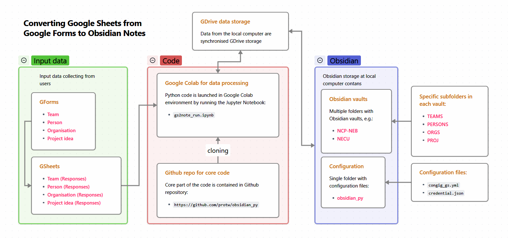

# Від Google Forms до нотаток Obsidian

250330



[toc]

### Вступ: постановка задачі

Ідея цієї розробки стала наслідком взаємодії [Національного Контактного Пункту (НКП)](https://uhsp.edu.ua/2024/12/09/na-bazi-ugsp-tryvaye-robota-naczionalnogo-kontaktnogo-punktu-nova-yevropejska-inicziatyva-baugauz-dajdzhest-podij-lystopada/) New European Bauhaus (NEB) на базі Університету Григорія Сковороди у Переяславі (УГСП) з командою [Національного Екологічного Центру України (НЕЦУ)](https://necu.org.ua/). 

Проблема, що постала перед НКП, полягала у необхідності збору і опрацювання великого обсягу інформації про наявні конкурси, потенційних заявників і партнерів, а також про проєктні ідеї. Складність завдання сама по собі ще посилювалась обмеженістю людського ресурсу НКП.

На цьому тлі НЕЦУ запропонував ідею створення робочого простору НКП NEB з використанням інструменту [Obsiidan](https://obsidian.md/). Запропоноване рішення мало вирішити такі проблеми:

- започаткувати системний підхід в допомозі українським учасникам щодо формування проєктних заявок на євпропейські грантові конкурси
- систематизувати інформацію про європейських та українських партнерів і консорціуми, програми і конкурси, зокрема, в програмі НЄБ Горизонт Європа, але не обмежуючись останньою.
- сприяти утворенню і підтримці мережевої взаємодії заявників.

Згодом було вирішено побудувати систему технічну реалізацію запропонованої ідеї на сполучені:

- Google Forms для збирання структурованої інформації від потенційних заявників,
- Obsidian для зберігання та аналізу зібраної інформації з подальшим плануванням і реалізацією заходів підтримки заявників у процесах пошуку партнерів і підготовки заявок.
- Застосунок з конвертації даних з Google Forms у формат Obsidian.

Загальна блок-схема представлена на рисунку вище.

Нижче описані такі технічні аспекти реалізації:

- Автоматизоване завантаження даних з таблиць відповідей Google Forms.
- Зв'язок між полями таблиці і властивостями нотаток Obsidian.
- Алгоритм конвертації таблиці відповідей Google Forms до нотаток Obsidian.
- Запуск застосунку.

### Автоматизоване завантаження таблиць Google Sheets

Програмне завантаження (тобто без необхідності взаємодії з користувачем) таблиць Google Sheets вимагатиме передачу застосунку певних закритих реквізитів безпеки. Задача тут полягає в тому, щоб ці реквізити перебували у захищеному недоступному для сторонніх місці.

Отже, розпочнімо з питання активації Google Sheets API та Google Drive API. Покрокова процедура активації винесена в окремий [документ](doc/Активація_GSheets_та_GDrive_API.md), щоб не відволікатися тут від основного викладення.

В результаті проведення цієї процедури буде утворений файл облікових даних сервісного акаунту Google Drive. Ви назвете цей файл **`credentials.json`** і розмістите у фолдері `obsidian_py/` поруч з фолдером вашого сховища даних Obsidian. Наприкінці цього тексту я опишу [порядок підготовки вашого робочого простору](#Порядок підготовки власного робочого простору), з якого буде чітко зрозуміло що і куди класти.

Приклад файлу облікових даних сервісного акаунту можна глянути в репозитарії застосунку на Github - [credentials_example.json](https://github.com/protw/obsidian_py/blob/master/credentials_example.json). Якщо вам цікаво розібратися зі структурою, то ви можете глянути окремий документ -  [Зміст файлу credentials.json.md](doc/Зміст_файлу_credentials.json.md).

**⚠️ Важливий момент**

У таблиці Google Sheets:

1. Відкрий таблицю.
2. Поділися нею через: **`your-service-account@your-project-id.iam.gserviceaccount.com`**.
3. Дай права **Редагування** або **Перегляд**.

Повний текст автоматизованого завантаження таблиці Google Sheets vj;yf ukzyenb у методі [`read_gs_table`](https://github.com/protw/obsidian_py/blob/master/gs2note.py#L106).

<u>Підсумок</u>: що класно в цьому способі:

✅ Автоматично працює без браузера.
✅ Немає потреби логінитися вручну.
✅ Один акаунт може отримувати доступ до кількох таблиць.
✅ Токен оновлюється автоматично.

### Зв'язок між полями таблиці і властивостями нотаток

В результаті конвертування таблиці Google Sheets відповідей Google Forms у нотатки Obsidian поля форми будуть перетворені або у властивості нотатки або у підрозділи тексту нотатки. Також деякі поля можуть потребувати певної обробки.

Необхідний формалізований опис зв'язків між полями форми (таблиці), з одного боку, і властивостями та підрозділами нотаток, з іншого, складений у файлі [`config.yml`](config.yml).

Ключі (елементи) верхнього рівня у цьому файлі, а саме: **`[teams, orgs, persons, proj]`** означають тип вхідної таблиці і відповідних нотаток Obsidian типу **Команди**, **Організації**, **Персони** та **Проєктні ідеї**, відповідно.

Кожний із цих ключів вернього рівня містить однакову [структуру даних](https://gist.github.com/protw/cc816fbcb5820e6ec5f2bf4f1940ad8b) з таким призначенням елементів:

| Ключ               | Призначення                                                  |
| ------------------ | ------------------------------------------------------------ |
| **`subdir`**       | Субфолдер Obsidian-сховища, де зберігаються нотатки цього типу |
| **`name`**         | Ім'я файлу таблиці Google Sheets відповідей Google Forms     |
| **`cols`**         | Назви всіх полів Google Forms (і, відповідно, стовпчиків таблиці Google Sheets) |
| **`frontmatter`**  | Назви полів Google Forms, що підуть як властивості до фронтматерії нотаток Obsidian |
| **`sections`**     | Назви полів Google Forms, що підуть як заголовки до нотаток Obsidian |
| **`not_required`** | Список необов'язкових полів Google Forms (поки що не використовується) |
| **`pers_name`**    | Список полів Google Forms, що будуть перетворені перед розміщенням у нотатки з допомогою метода [`pib2ip`](https://github.com/protw/obsidian_py/blob/master/gs2note.py#L205) |
| **`linked`**       | Список полів Google Forms, що будуть перетворені як внутрішні посилання Obsidian перед розміщенням у нотатки з допомогою метода [`make_linked`](https://github.com/protw/obsidian_py/blob/master/gs2note.py#L219) |
| **`label_refs`**   | Зв'язування назви властивості нотатки Obsidian (ключ) з назвою поля Google Forms (значення). Відповідне значення поля Google Forms передається у значення властивості нотатки Obsidian |
| **`label_vals`**   | У значення властивості нотатки Obsidian (ключ) передається значення ключа із цього файлу або це значення використовується для певного перетоврення |

### Загальний алгоритм конвертації таблиці до нотаток

Процедура конвертації таблиці у нотатки повністю описана класом `GS2ON_Convertor` у модулі `gs2note.py` і розділена на два етапи: перший – під час ініціації (метод [`__init__`](https://github.com/protw/obsidian_py/blob/master/gs2note.py#L38)) і другий – у методі [`main`](https://github.com/protw/obsidian_py/blob/master/gs2note.py#L315).

На першому етапі проводяться [такі дії](https://gist.github.com/protw/d084f60824c8deaad72237ddb0b0d923):

| Метод                                                        | Дії                                                          |
| ------------------------------------------------------------ | ------------------------------------------------------------ |
| [check_dupl_in_vault](https://github.com/protw/obsidian_py/blob/master/gs2note.py#L68) | Перевірка дублікатів назв нотаток у сховищі Обсідіан         |
| [read_yaml_config](https://github.com/protw/obsidian_py/blob/master/gs2note.py#L93) | Зчитування двох конфігураційних файлів [`config.yml`](config.yml) та [`config_gs.yml`](config_gs_example.yml) (⚠️) і створення спільного конфігураційного словника `conf` |

⚠️ Примітка: тут зазначене посилання на приклад, ви маєте створити під цим же іменем і за цією ж структурою свій конфіденційний файл.

На другому етапі проводиться довший [перелік дій](https://gist.github.com/protw/362071e52c4667b50343d0ce3ae0e7b9):

| Метод                                                        | Дії                                                          |
| ------------------------------------------------------------ | ------------------------------------------------------------ |
| [`read_gs_table(table)`](https://github.com/protw/obsidian_py/blob/master/gs2note.py#L106) | Зчитуємо вхідні дані з таблиці Google Forms заданого типу `table` і опис її конвертування до Obsidian |
| [`check_table_struct`](https://github.com/protw/obsidian_py/blob/master/gs2note.py#L147) | Валідація структури вхідної таблиці Google Forms і словника з описом конвертування цієї таблиці до Obsidian |
| [`pib2ip`](https://github.com/protw/obsidian_py/blob/master/gs2note.py#L205) | Перетворення значень стовпчиків зі списку `pers_name` з вхідного датафрейму: "Прізвище Ім'я По-батькові" -> "Ім'я Прізвище" |
| [`make_linked`](https://github.com/protw/obsidian_py/blob/master/gs2note.py#L219) | Перетворення значень стовпчиків зі списку `linked` з вхідного датафрейму у внутрішнє Obsidian-посилання: `name -> [[name]]` |
| [`dfgf2dfob`](https://github.com/protw/obsidian_py/blob/master/gs2note.py#L227) | Копіювання вхідної таблиці `dfgf` з довгими назвами стовпчиків у таблицю зі скороченими назвами стовпчиків `dfob` |
| [`check_dupl_in_table`](https://github.com/protw/obsidian_py/blob/master/gs2note.py#L244) | Перевірка відсутності дублікатів імен нотаток у вхідній таблиці |
| [`complete_obs_table`](https://github.com/protw/obsidian_py/blob/master/gs2note.py#L255) | Завершення підготовки Obsidian таблиці перед конвертацією у нотатки |
| [`create_notes`](https://github.com/protw/obsidian_py/blob/master/gs2note.py#L280) | Створення нотаток у сховищі Обсідіан з вх. таблиці Гугл Форм |

### Порядок підготовки власного робочого простору

#### 1. Підготовка файлової структури на локальному комп'ютері

Для початку встановлюємо Obsidian на локальному комп'ютері. Тут я не зупиняюсь на встановленні цього застосунку через те, що це, по-перше, тривіальне завдання, а по друге, це не є предметом цього документу.

⚠️ Важливо зазначити структуру шляхів розміщення ваших Obsidian сховищ (vaults). Скажімо, ми маємо два сховища: **`NCP-NEB`** і **`NECU`**. У кожному зі сховищ ви можете мати субфолдери: **`ORGS`**, **`PERSONS`**, **`PROJ`** і **`TEAMS`** для зберігання нотаток щодо організацій, осіб, проєктних ідей і команд, відповідно. 

Також, нам треба організувати окремий службовий фолдер **`obsidian_py`**, де ми розмістимо конфігураційні файли: **`credentials.json`** та **`config_gs.yml`**, а також Jupyter Notebook **`gs2note_run.ipynb`** для запуску застосунку. 

Також у цьому фолдері можна розмістити форми Google Forms разом з їхніми таблицями відповідей. 

У підсумку файлова структура на локальному комп'ютері матиме такий вигляд:


#### 2. Встановлення синхронізації з Google Drive

⚠️ Ми працюємо в Obsidian невеликою командою. Тому наступним кроком має стати налаштування синхронізації фолдера `D:/path_to_all_your_vaults_storage/` з Google Drive. Тут важливим моментом є те, щоб в результаті синхронізації фолдер **`OBSIDIAN/`** став доступним з кореню MyDrive на Google Drive. Якщо цього не спостерігається, то на Google Drive треба зробити ярлик (*shortcut*) фолдера **`OBSIDIAN/`** у MyDrive (якщо не знаєш як, то [інструкція тут](https://support.google.com/drive/answer/9700156?hl=uk&co=GENIE.Platform%3DDesktop)).

#### 3. Налаштування Jupyter Notebook

На останок потрібно зафіксувати вашу структуру у комірці вхідних параметрів Jupyter Notebook **`gs2note_run.ipynb`** у змінних **`vault`** і **`table`**, а також у словнику **`folders`**. Для цього відкрийте цей Jupyter Notebook в бравзері через Google Drive і, у разі потреби, внесіть необхідні зміни:

```python
# @title Вхідні параметри

# @markdown Оберіть Обсідіан-сховище (**vault**):
vault = 'NECU' #@param ['NECU', 'NCP-NEB']

# @markdown Оберіть тип таблиці (**table**), що буде конвертований з Гугл форми
# @markdown до обраного сховища:
table = 'persons' #@param ['persons', 'teams', 'orgs', 'proj']

# ==== УВАГА! Цей розділ Colab комірки лише для адміна!! ====

# Якщо ви не знаєте призначення налаштувань нижче, або не впевнені в тому
# що знаєте, то нічого не чипайте
folders = {
    'base': '/content/drive',
    'vaults_base': '/MyDrive/OBSIDIAN/',
    'code_dir': 'obsidian-py/'
}

# В робочому положенні ВСІ елементи словника `cond` мають бут встановлені `True`
cond = {
    'is_dupl_in_vault': True, # Рекомендовано True, за замовчанням
    'is_dupl_in_table': True,  # Рекомендовано True, за замовчанням
    'not_write_dupl':   True,  # Рекомендовано True, за замовчанням
    'is_clean_writing': True  # За замовчанням True
}
```

⚠️ Зверніть увагу на рядки коментарів, що починаються з **`#@param`**. Ці рядки несуть чіткий семантичний зміст, а саме: формують інтерфейс користувача у вигляді меню зі спадним списком під час запуску Jupyter Notebook. Якщо цікаво, то докладно цей підхід до формування користувацького інтерфейсу описаний тут - [Forms - Colab](https://colab.research.google.com/notebooks/forms.ipynb). 

#### 3. Налаштування запуску на локальному комп'ютері

У разі запуску застосунку з локального комп'ютера необхідно зафіксувати вашу структуру у файлі **`gs2note_run.py`**:

```python
import gs2note

# ==== ВХІДНІ ПАРАМЕТРИ ====

# Оберіть Обсідіан-сховище (vault):
vault = 'NECU' # обрати зі списку ['NECU', 'NCP-NEB']

# Оберіть тип таблиці (table), що буде конвертований з Гугл форми
# до обраного сховища:
table = 'persons' # обрати зі списку ['persons', 'teams', 'orgs', 'proj']

# ==== УВАГА! Цей розділ лише для адміна!! ====

# Якщо ви не знаєте призначення налаштувань нижче, або не впевнені в тому
# що знаєте, то нічого не чипайте
folders = {
    'base': 'D:/boa_uniteam/',
    'vaults_base': 'OBSIDIAN/',
    'code_dir': 'obsidian-py/'
}
# В робочому положенні ВСІ елементи словника `cond` мають бут встановлені `True`
cond = {
    'is_dupl_in_vault': True, # Рекомендовано True, за замовчанням
    'is_dupl_in_table': True,  # Рекомендовано True, за замовчанням
    ## ---- СХОВАТИ ВІД КОРИСТУВАЧА ----
    'not_write_dupl':   True,  # Рекомендовано True, за замовчанням
    'is_clean_writing': True  # За замовчанням True
}

conv = gs2note.run(vault=vault, table=table, folders=folders, cond=cond)
```

#### 3. Налаштування Google Forms

Для зручності наперед підготовлені чотири зразки Google Forms: **`Команда`**, **`Організація`**, **`Персона`** і **`Проєктна ідея`**:

- [Команда](https://docs.google.com/forms/d/1H-bDiYkjdoo7HTm3EVuRlSJrc4EwAXsknj1Y1pSFB04/edit)
- [Організація](https://docs.google.com/forms/d/1m094KZrvDN2TatReSDv824ERRQapbxf-FAJ0-S8mhJA/edit)
- [Персона](https://docs.google.com/forms/d/1CfsYUdYOev5Zdb7VO89Iin4onLy3LtWeKiKcInBj58Q/edit)
- [Проєктна ідея](https://docs.google.com/forms/d/1vZA1igquxMLhsSFB4fd-QayNb8aW3uBNwlikZZ38b8A/edit)

Ці зразки є готовими формами, але не призначені для заповнення. Тому для своєї роботи **обов'язково** зробіть з кожної форми свою копію, з якою ви будуте працювати. Для цього 

1. відкрийте форму у бравзері;

2. якщо праворуч вгорі на формі замість вашого аватару є напис "Увійти", то спочатку увійдіть під своїм робочим акаунтом;

3. натисніть значок "три вертикальні крапки" поруч (лівіше) з вашим аватаром і оберіть "Зробити копію";

4. ⚠️ під час копіювання зробіть так, щоб ім'я форми в точності збігалось з оригіналом (а саме: **`Команда`**, **`Організація`**, **`Персона`** і **`Проєктна ідея`**), і тут же перемістіть форму у фолдер **`OBSIDIAN/obsidian_py/`** на Google Drive;

5. зв'яжіть форму з таблицею відповідей, для чого з трьох елементів меню (посередині вгорі форми); **`Запитання | Відповіді | Налаштування`** оберіть **`Відповіді`** і далі натисніть **`Зв'язати з Таблицями`**; в результаті біля форми на Google Drive з'явиться таблиця Google Sheets, наприклад: **`Команда (Відповіді)`**.

6. вставте Google ідентифікатор **`<gs_identifier>`** новоствореної таблиці відповідей

   ```
   https://https://docs.google.com/spreadsheets/d/<gs_identifier>/edit
   ```

    у відповідний рядок конфігураційного файлу **`config_gs.yml`**:

   ```yaml
   gs_domain: https://docs.google.com/spreadsheets/d/
   gs_id:
       teams: <google-sheets-id-for-teams-table>
       orgs: <google-sheets-id-for-orgs-table>
       persons: <google-sheets-id-for-persons-table>
       proj: <google-sheets-id-for-proj-table>
   ```

7. активуйте Google Sheets API та Google Drive API, як це зазначено у розділі [Автоматизоване завантаження таблиць Google Sheets](#Автоматизоване завантаження таблиць Google Sheets); ⚠️ не забудьте поширити таблицю на новостворений сервісний акаунт.

### Запуск застосунку

Ну начебто все налаштовано, форми заповнені користувачами — час запускати.

Тут ми опустимо запуск конвертора на локальному комп'ютері, бо це варіант для тих ентузіастів, що мають встановлений Python.

Стандартний варіант це запуск конвертора з хмари, з-під Google Colab:

1. відкрийте на Google Drive фолдер **`OBSIDIAN/obsidian_py/`** і зробіть подвійний клік на  Jupyter Notebook **`gs2note_run.ipynb`**;

2. у відкритому Jupyter Notebook оберіть зі спадних меню потрібні Obsidian-сховище (**`vault`**) і таблицю (**`table`**);

3. запустіть Jupyter Notebook натиснувши **CTRL+F9** або через меню **Середовище виконання / Виконати всі**.

4. в результаті успішного виконання у вас з'явиться щось подібне до цього:

   ```
   ✅ Фолдер Обсідіан-сховища: /content/drive/MyDrive/OBSIDIAN/NECU/
   ✅ Фолдер налаштувань: /content/drive/MyDrive/OBSIDIAN/obsidian-py/
   ✅ Тип конвертованої таблиці: persons
   ЗАПУСК КОНВЕРТОРА
   ✅ Зчитана таблиця PERSONS розміром (3, 12)
   ✅ Валідація відповідності структури таблиці `PERSONS` пройдена
   ✅ У субфолдері NECU/PERSONS створено 3 нотаток: ['Євген Бовсуновський', 'Олег Бондаренко', 'Дмитро Іванов']
   ```

⚠️ Obsidian "не любить" дублікати імен (назв) нотаток. Кожна нотатка має мати унікальне ім'я. Тому, у разі знаходження дублікатів імен або в таблиці відповідей Google Forms, або у Obsidian-сховищі застосунок зупиниться і повідомить про список імен-збігів. Ваша задача позбавитись збігів окремо у вхідній таблиці або окремо у Obsidian-сховищі (це ручна робота) і запустити застосунок знов. До речі, якщо ви запустите Jupyter Notebook повторно після першого успішного запуску, то застосунок пропустить збіги імен нотаток між вхідною таблицею і сховищем та повідомить про нуль новостворених нотаток.

У-у-уф! Це все! Насолоджуйтесь!
